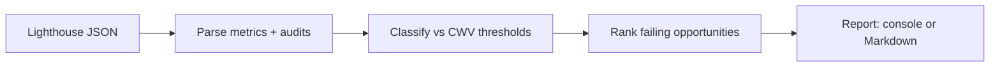

# core-web-vitals-reporter

> Turn a Lighthouse JSON report into a focused Core Web Vitals summary with pass/fail classification and prioritized fixes.


## Overview

`core-web-vitals-reporter` ingests a Lighthouse JSON report and extracts the metrics that actually gate ranking and UX — **LCP, CLS, INP** (plus TBT, FCP, Speed Index) — classifies each as *good / needs-improvement / poor* against the published thresholds, and surfaces the top failing audits with their estimated savings. It works entirely on a JSON file, so no browser or network run is needed.

## Architecture



## Features

- Extracts LCP, CLS, INP, TBT, FCP, and Speed Index (tolerant of missing keys)
- Classifies each metric *good / needs-improvement / poor* using standard Core Web Vitals thresholds
- Surfaces top opportunities with estimated savings
- Console **or** Markdown output (drop straight into a PR comment)
- Runs offline on a JSON file

## Tech stack

Python 3.11 · Click · Rich

## Getting started

```bash
pip install -e .
# report on the bundled sample Lighthouse run
core-web-vitals-reporter --input data/sample_lighthouse.json
# Markdown output for a PR / docs
core-web-vitals-reporter --input data/sample_lighthouse.json --format markdown
```

## Usage

Point it at any Lighthouse JSON (`lighthouse https://site --output json --output-path report.json`). The bundled `data/sample_lighthouse.json` mixes passing and failing metrics so you can see the classification and the recommendations the tool derives from the failing audits.

## Metrics & thresholds

| Metric | Good | Needs improvement | Poor |
| --- | --- | --- | --- |
| LCP (Largest Contentful Paint) | ≤ 2.5 s | ≤ 4.0 s | > 4.0 s |
| CLS (Cumulative Layout Shift) | ≤ 0.1 | ≤ 0.25 | > 0.25 |
| INP (Interaction to Next Paint) | ≤ 200 ms | ≤ 500 ms | > 500 ms |

## Project structure

```
cwvreporter/
  parse.py        # extract metrics + audits from Lighthouse JSON
  thresholds.py   # CWV thresholds + classify()
  report.py       # console + Markdown + recommendations
  cli.py          # Click entrypoint
data/             # sample Lighthouse report
tests/            # pytest: extraction + boundary classification
```

## Testing

```bash
pip install -e . pytest
pytest
```

## Roadmap

- Pull directly from the PageSpeed Insights API
- Blend in CrUX field data alongside lab metrics
- Budget thresholds that fail CI

## License

MIT © 2026 Matthews Wong

---

_Part of my cloud & AI portfolio — see [github.com/matthews-wong](https://github.com/matthews-wong)._
